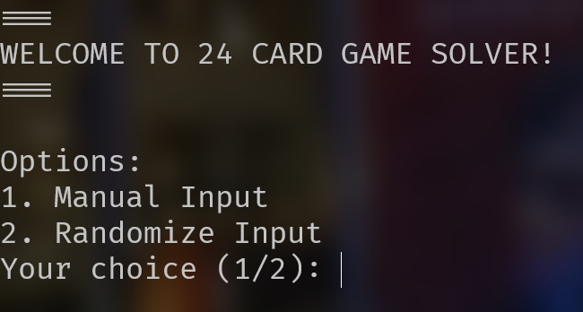

# 24 Card Game Solver

24 Card Game Solver adalah program yang menampilkan solusi dari 24 Card Game. 24 Card Game adalah permainan kartu aritmetika dengan tujuan mencari cara untuk 
mengubah 4 buah angka random sehingga mendapatkan hasil akhir sejumlah 24.

## Cara Penggunaan

1. Clone repository ini
2. Pastikan Anda telah berada pada folder root program
3. Gunakan perintah di bawah ini pada terminal untuk menjalan program
    ```bash
    ./bin/main
    ```
4. Jika program berjalan dengan sesuai, Anda akan melihat tampilan sebagai berikut,
    

Made with ❤️ by I Putu Bakta Hari Sudewa (13521150)
